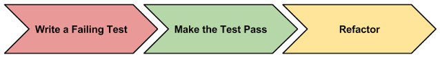

Getting started with Unit Testing for AngularJS
===

Jasmine是一套BDD的framework. 但它也可以用來寫TDD。那BDD與TDD有麼差異? 它們的風格是不同的。但是還是可以使用Jasmine來做TDD。這個framework提供結構
化的方式來組織這些測試並且以函式來主張我們程式碼的輸出。

# Writing your first unit test
最簡單的測試方式是載入Jasmine後，使用以下的程式就可以做測試了。

1. 安裝Jasmine
```
bower install jasmine --save-dev 
```

2. 使用測試結果範本
若是使用karma, karma-jasmine-html-reporter, 就不需使用以下範本。 但若是使用local的server來載入測試，就要用這個範本來顯示測試結果。

```
<html>
    <head>
        <link rel="stylesheet" type="text/css" href="https://cdnjs.cloudflare.com/ajax/libs/jasmine/2.3.3/jasmine.min.css">
        <script src="https://cdnjs.cloudflare.com/ajax/libs/jasmine/2.3.3/jasmine.min.js"></script>
        <script type="text/javascript" src="https://cdnjs.cloudflare.com/ajax/libs/jasmine/2.3.3/jasmine-html.min.js"></script>
        <script type="text/javascript" src="https://cdnjs.cloudflare.com/ajax/libs/jasmine/2.3.3/boot.min.js"></script>
    </head>
    <body>
    </body>
    <script type="text/javascript">

        // Paste in the test code here.

    </script>
</html>
```

3. 寫測試程式
加入以下程式段。 `describe`是來宣告這是一個sepc(測試的邏輯群組), 而`it`是在測試的邏輯群組中的一個測試項目。 而這樣的寫法讓狀態處於`pending state`, 所以不會產生測生測試結果。
```
describe('calculator', function () {
    it('1 + 1 should equal 2');
});
```

4. 補上預期測試結果
```
it('1 + 1 should equal 2', function() {
    expect(1 + 1).toBe(1);
});
```

結果會顯示錯誤，因為1+1要是2. `Expect (called an Expectation)`用來包裝我們測試的運算式, 然後可以呼叫函數來assert(判斷)運算式的結果, 而這些函數又稱為`Matchers (the function toBe)`. 其他常用的matcher如下:

```
expect(true).toBe(true);
expect(false).not.toBe(true);
expect(1).toEqual(1);
expect('foo').toEqual('foo');
expect('foo').not.toEqual('bar');
```
將上述程式修正後可得到正確的輸出結果。
```
it('1 + 1 should equal 2', function() {
    expect(1 + 1).toBe(2);
});
```

# Getting into the unit testing flow
TDD開發流程如下:


* Red: 先寫一個錯誤的測試
* Green: 將程式寫好滿足需求。
* Refactoyr: 重構。

1. Write a failing test
This test will fail, because we don't have any implementation detail for the calculator:
```
describe('calculator', function () {

    it('1 + 1 should equal 2', function () {
        expect(calculator.sum(1, 1)).toBe(2);
    });

});
```

2. Make the test pass
If we write just enough code to make the test pass, we should have something that resembles this:
```
var calculator = {
    sum: function(x, y) {
        return 2; // <-- note this is hardcoded
    }
}

describe('calculator', function () {

    it('1 + 1 should equal 2', function () {
        expect(calculator.sum(1, 1)).toBe(2);
    });

});
```
Doing this helps to rule out any mistakes with the the code for the test itself.


3. Refactor
Now that we've established that our test logic is ok, we can go ahead and add more of the logic. As long as we still see passing tests, we can have confidence in our code:

```
var calculator = {
    sum: function(x, y) {
        return x + y;
    }
}

describe('calculator', function () {

    it('1 + 1 should equal 2', function () {
        expect(calculator.sum(1, 1)).toBe(2);
    });

});
```